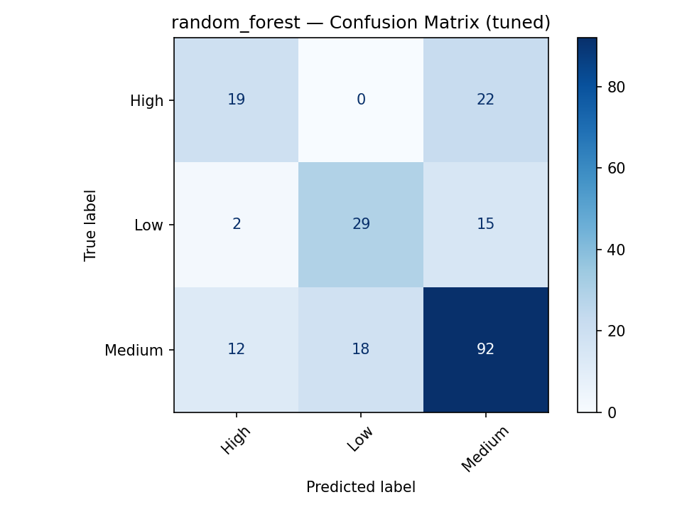
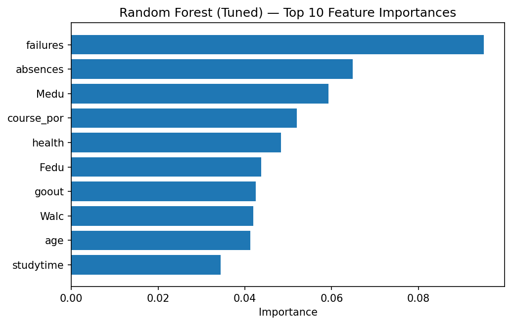
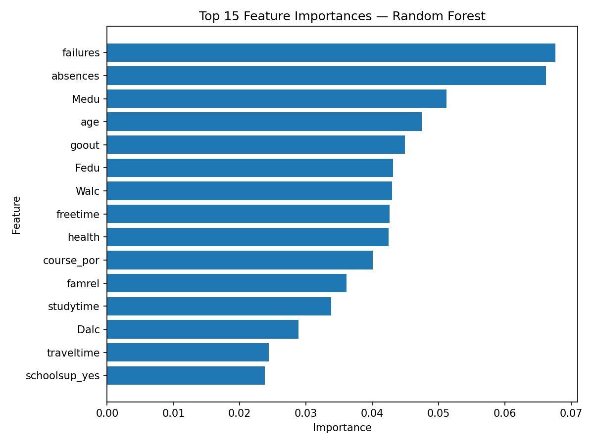
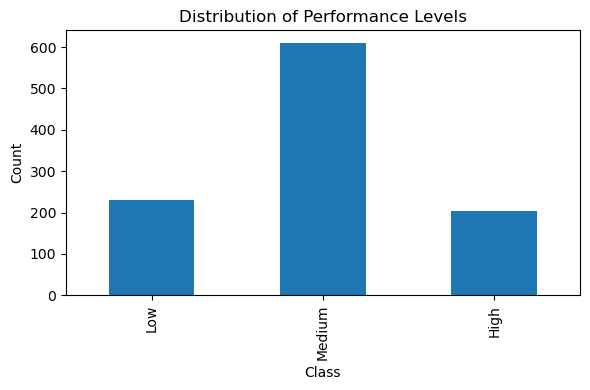

# Predicting Student Academic Performance  
**Team 4 – AAI 500: Probability and Statistics for Artificial Intelligence (Fall 2025)**  
Noslinn Gisselle Tosta, Francisco Monarrez Félix, Tavia Wooten  
University of San Diego – MS Applied Artificial Intelligence  
Date: October 19, 2025  

---

## Abstract
This project explores predictive modeling of student academic performance using demographic, social, and educational variables from the UCI Student Performance dataset. After data cleaning, feature encoding, and model development, three machine learning models—Logistic Regression, Random Forest, and SVM—were evaluated using accuracy and macro-F1 metrics. Random Forest achieved the best performance (accuracy 0.67, macro-F1 0.62). The results suggest that study engagement, parental education, and attendance are key drivers of academic success.

---

## 1. Introduction
Our team selected the **UCI Student Performance dataset**, which combines information from two secondary school courses (Math and Portuguese). The dataset includes demographic, social, and academic attributes of students, with final grade (G3) serving as the target variable.  

The objective of our analysis is to explore factors that influence student performance and to establish predictive baselines. Specifically, we aim to answer:  
1. Which demographic, social, and academic factors are most strongly associated with final course performance (G3)?  
2. Can classification models reasonably predict overall performance levels (Low, Medium, High)?  

These questions guided our cleaning, exploratory data analysis (EDA), and modeling steps.

---

## 2. Methodology
The cleaning and preparation process followed these main steps:
- Imported both datasets (`student-mat.csv` and `student-por.csv`).
- Inspected the data (`.info()` and `.head()`) to understand structure and spot inconsistencies.
- Saved copies of raw datasets for reference.
- Merged the two datasets into a single file (`merged_student.csv`).
- Checked for missing values and removed incomplete rows (`dropna()`).
- Checked for duplicates and removed them.
- Saved the cleaned dataset as `student_clean.csv` for further analysis.

The final cleaned dataset contains **1,044 rows × 34 columns**.  
No imputation was performed to avoid data leakage; instead, incomplete records were dropped prior to splitting.

---

## 3. Exploratory Data Analysis (EDA)
We examined both numeric and categorical variables to understand the dataset before modeling.

### Numeric variables
- Most students were between 16 and 18 years old.  
- Final grade (G3) distribution was skewed toward the middle range (10–15 out of 20).  
- Absences were highly skewed, with most students below 10 and a few exceeding 50.  
- Mean final grade (G3) ≈ 11.9 (std ≈ 3.2).  

### Categorical variables
- Slightly more female than male students.  
- Most lived in urban areas and had internet access.  
- A large majority expressed the desire to pursue higher education.  

### Correlations
- Strong positive correlations between G1, G2, and G3.  
- Moderate positive correlations between parental education (`Medu`, `Fedu`) and student grades, suggesting that family background contributes to academic outcomes.  

**Summary:**  
EDA suggested that **grades, absences, and family background** are likely to be important predictors of student performance. These findings guided model selection and interpretation.

---

## 4. Model Development (Baseline)
We trained three baseline classifiers — **Logistic Regression**, **Random Forest**, and **SVM (RBF)** — on the cleaned, merged dataset to predict `performance_level` (Low <10, Medium 10–14, High ≥15). Grades G1, G2, and G3 were excluded from predictors to prevent leakage, since G3 defines the target variable.

| Model | Accuracy | Macro-F1 |
|--------|-----------|-----------|
| Logistic Regression (no leak) | 0.507 | 0.504 |
| **Random Forest** | **0.636** | **0.502** |
| SVM (RBF kernel) | 0.474 | 0.479 |

**Training details**
- Train/test split: 80/20 stratified, `random_state=42`  
- Logistic Regression: scaled with `StandardScaler(with_mean=False)`, `class_weight='balanced'`  
- Random Forest: `n_estimators=300`, `min_samples_split=4`, `class_weight='balanced'`  
- SVM: RBF kernel, `C=2.0`, `gamma='scale'`, `class_weight='balanced'`

---

## 5. Results and Discussion (Tuned Models)
To improve generalization, we performed **GridSearchCV** (5-fold stratified, macro-F1 scoring) on all three models.

| Model | Accuracy | Macro-F1 |
|--------|-----------|-----------|
| Logistic Regression (tuned) | 0.589 | 0.536 |
| **Random Forest (tuned)** | **0.670** | **0.623** |
| SVM (RBF, tuned) | 0.536 | 0.533 |

**Best hyperparameters**
- Logistic Regression: `C=0.25`, `penalty='l2'`, `solver='liblinear'`
- Random Forest: `n_estimators=200`, `max_features='log2'`, `min_samples_split=2`, `min_samples_leaf=4`
- SVM: `C=4.0`, `gamma=0.01`

**Results summary**
- **Random Forest** improved most after tuning, confirming that nonlinear interactions among social, demographic, and academic features are important.  
- **Logistic Regression** offered the most interpretable coefficients but slightly lower predictive power.  
- **SVM** performed moderately well but struggled with class imbalance, especially for the “Medium” category.

All confusion matrices, feature importances, and metrics were exported to  
`data/model_outputs/`.  
*(See Figure 1: Random Forest Confusion Matrix; Figure 2: Top 10 Feature Importances.)*

---


### 5.1 Model Analysis 

The tuned models demonstrated clear improvements over the baselines, particularly for Random Forest, which achieved the highest overall accuracy and balanced performance across all classes. Logistic Regression improved modestly after tuning, while SVM continued to underperform in comparison, primarily due to the challenge of class imbalance.

**Comparison of Baseline vs Tuned Models**
Baseline results showed that Random Forest already performed best, with an accuracy of approximately 0.64. After parameter optimization, accuracy increased to **0.67** and macro-F1 to **0.62**, confirming that fine-tuning hyperparameters enhanced generalization. Logistic Regression improved from 0.51 to 0.59 accuracy, while SVM improved slightly to 0.54 accuracy and 0.53 macro-F1. These improvements demonstrate that tuning was beneficial but model performance still varied by algorithm complexity.

**Model Interpretability and Key Insights**
The Random Forest model was selected as the best-performing classifier due to its ability to capture nonlinear feature interactions and handle mixed data types effectively. It outperformed Logistic Regression, which was more limited to linear relationships, and SVM, which was less robust to class imbalance.
Feature importance analysis revealed that **failures**, **absences**, and **parental education (Medu, Fedu)** were the most influential variables in predicting student outcomes. Behavioral factors such as **alcohol consumption (Walc, Dalc)** and **study time** also had notable effects. These results suggest that **academic engagement, attendance, and family background** are among the strongest drivers of student success.

**Interpretation of Model Behavior**
The Random Forest confusion matrix showed that most misclassifications occurred between **Medium** and **High** performers, reflecting overlap in their grade ranges. The “Low” performance group was classified more reliably, suggesting clearer separation from the others.
Overall, Random Forest provided the best trade-off between interpretability and predictive power, indicating that nonlinear relationships between behavioral and social variables play a major role in academic outcomes.

**Visual References**


*Figure 5.1.1: Confusion matrix of the tuned Random Forest model showing classification distribution across performance levels.*


*Figure 5.1.2: Top 10 most important features in predicting performance, highlighting behavioral and family-related variables.*


*Figure 5.1.3: Extended feature importance chart showing influence of study time, alcohol use, and absences on performance.*


*Figure 5.1.4: Class distribution of performance levels in the dataset, showing slight imbalance toward the Medium group.*

---

## 6. Limitations
- Relationships are **correlational**, not causal.  
- Potential bias from **self-reported variables** (e.g., alcohol use, study time).  
- **Class imbalance** (Medium dominates).  
- **No imputation** was performed to prevent data leakage; incomplete records were removed.  
- Random Forest importances may favor continuous variables with more unique values.

---

## 7. Reproducibility
All code, datasets, and model outputs are fully reproducible via the included notebooks (`/notebooks`) and the final script (`/src/final_models.py`) in the GitHub repository.  
Model outputs and figures can be regenerated by running:  
```bash
python src/final_models.py
```

---

## 8. Conclusion and Recommendations
Model tuning significantly improved predictive accuracy, with the Random Forest model achieving the highest performance after optimization.  
Results highlight the impact of **study engagement**, **parental education**, and **attendance** on academic success.  

**Recommendations**
1. Future models could incorporate **balancing methods** (e.g., SMOTE) to improve recall for minority classes.  
2. Adding **SHAP value interpretation** can enhance explainability.  
3. Testing **gradient-boosted models** (XGBoost, CatBoost) may further improve performance without explicit imputation.  

**Final takeaway:**  
The project demonstrates that student performance can be predicted with moderate accuracy using demographic and behavioral data, emphasizing the strong influence of engagement and family support.

---

## 9. References
- Cortez, P., & Silva, A. (2008). *Using Data Mining to Predict Secondary School Student Performance.* University of Minho, Portugal. UCI Machine Learning Repository.  
- Pedregosa, F. et al. (2011). *Scikit-learn: Machine Learning in Python.* Journal of Machine Learning Research, 12, 2825–2830.